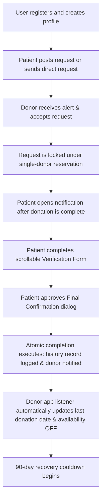
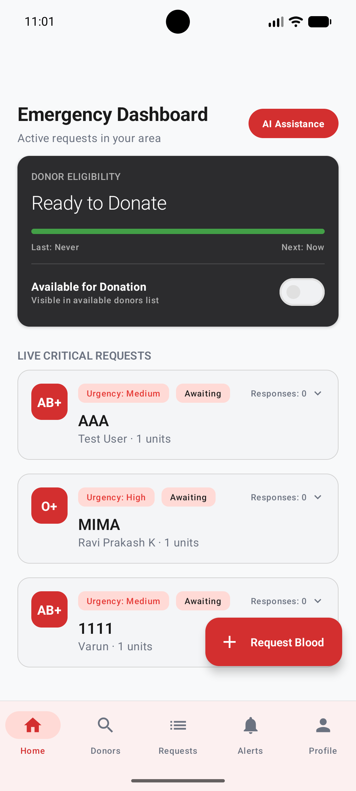
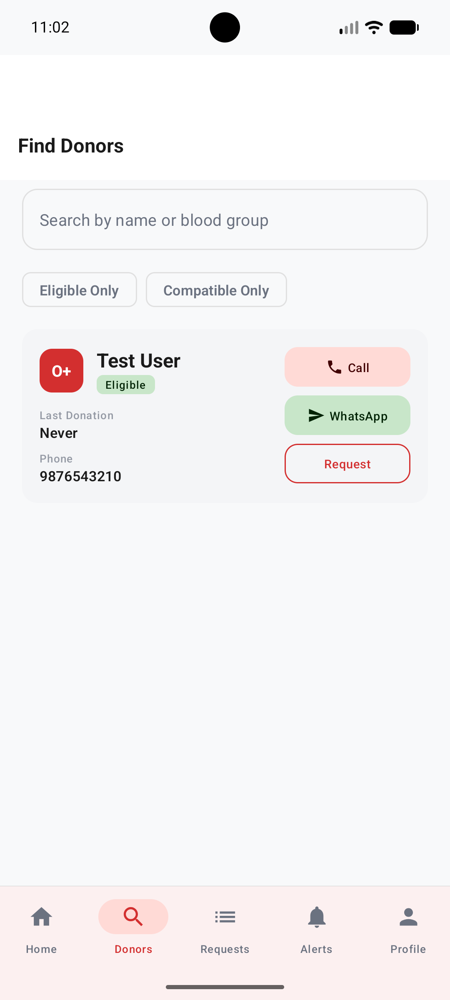
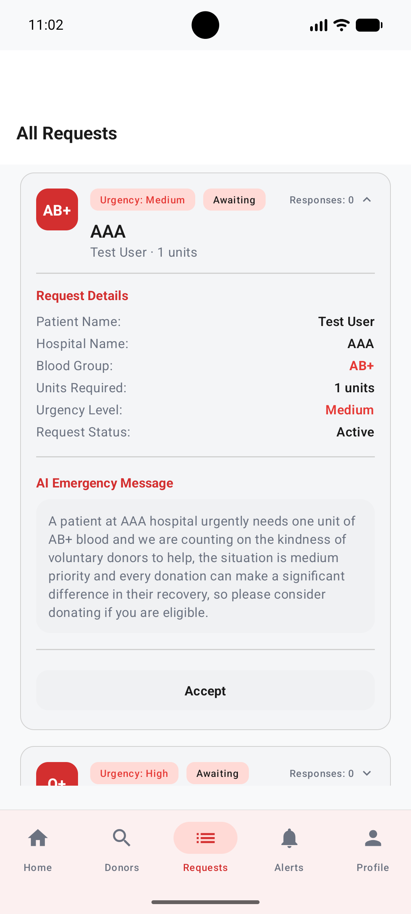
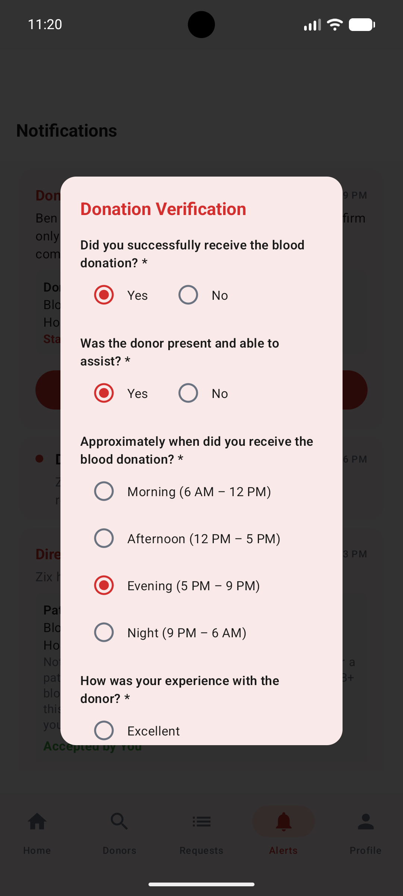
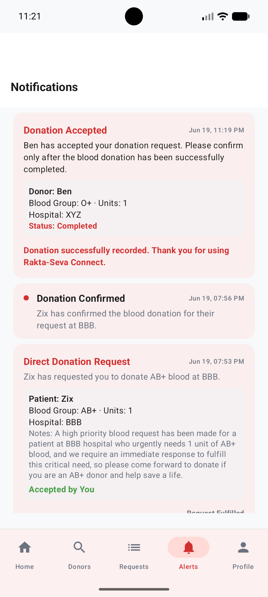
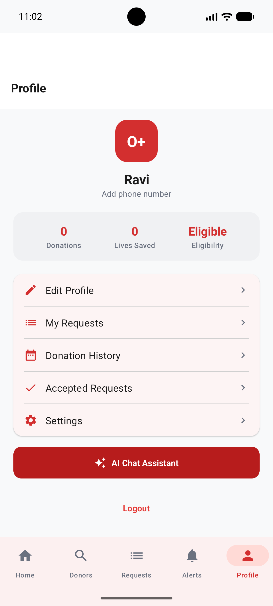

# Rakta-Seva Connect V2

A community-driven blood donation platform that connects donors and recipients through secure request management, real-time notifications, donation tracking, and eligibility monitoring.

---

## 📌 Project Overview

Access to blood during medical emergencies is a critical, time-sensitive issue. Delayed coordination and inefficient discovery of compatible donors often lead to fatal outcomes. **Rakta-Seva Connect V2** bridges this gap by offering a decentralized, secure, and real-time environment where patients can request blood, and compatible voluntary donors can accept requests instantly. By removing intermediaries and automating recovery tracking, the application provides a direct, reliable channel to save lives.

---

## ✨ Key Features

### 🔐 Authentication
* **User Registration**: Create a secure account with automatic single-line IME input navigation for all fields.
* **Secure Login**: Access user profiles securely verified via Firebase Authentication.
* **Profile Management**: Update your details (Full Name, Age, Blood Group, Last Donation Date) at any time.

### 🩸 Donor Discovery
* **Volunteer Donors Directory**: Discover available donors with compatible blood types based on the universal compatibility chart.
* **Email Privacy**: All email addresses are completely omitted from donor cards to protect personal privacy.
* **Direct Actions**: Initiate immediate phone calls or prefilled WhatsApp conversations directly from donor directory cards.
* **Eligibility Status**: Displays current donor status (Ready to Donate or under a 90-day Cooldown) to avoid contacting ineligible donors.

### 🚨 Blood Request Management
* **Emergency Requests**: Post blood requests outlining hospital location, units required, blood group, and urgency levels.
* **Direct Requests**: Send targeted request alerts to specific voluntary donors from the directory.
* **Duplicate Request Protection**: Prevents sending duplicate requests to the same donor if an active request (Pending or Accepted) is already outstanding.
* **Collapsible Details view**: Request cards on the home and request feeds are collapsible, featuring Compose animations, detailed patient information, and optional AI-generated appeal text.

### 🤖 AI Assistance & Chat
* **AI Chat Assistant**: Integrated Llama 3.3 model via Groq API to answer blood donation guidelines, compatibility rules, and recovery tips.
* **AI Urgent Message Generator**: Creates templated, human-like, high-impact appeal messages based on chosen urgency parameters.

### 🔔 Notification System
* **Alert Notifications**: Tracks direct request alerts, acceptances, and completions in a dedicated Alert Feed.
* **Notification Read States**: Keeps track of read/unread statuses with responsive dot markers.
* **Persistent States**: Hides confirm actions and updates the notification card inline with completion text once the request status completes.

### 🔄 Donation Verification
* **Patient Verification Questionnaire**: Tapping confirmation triggers a scrollable overlay questionnaire checking:
  1. Success of donation receipt (blocks completion if answered "No").
  2. Donor presence and assistance.
  3. Time period of donation.
  4. Donor experience rating (Excellent, Good, Average, Poor).
  5. Optional text feedback (up to 200 characters).
* **Final Confirmation Dialog**: Summarizes transaction effects (initiates recovery period, saves history record) before finalizing.
* **Atomic Transactions**: Guarantees that the requests collection state changes to `"completed"` and requestStatus becomes `"fulfilled"`, history gets logged, and the donor is notified.

### ⏳ Donor Eligibility Management
* **Automatic Cooldown Reset**: Once a request accepted by a donor is completed, the system automatically sets the donor's `lastDonationDate` to today's date and sets `isAvailable = false`.
* **Eligibility Notification**: Displays a customized recovery subtext (`"You are now eligible to donate again."`) once the 90-day cooldown expires.

---

## 🔄 Application Workflow



1. **Onboarding**: A user signs up, inputs their profile details, and configures their blood type.
2. **Post Request**: A patient posts a public emergency request or targets a donor directly from the directory.
3. **Acceptance**: An eligible donor receives a real-time notification alert and accepts, locking the request to prevent double-reservation.
4. **Donation Verification**: Upon receiving the blood, the patient taps the alert to open a scrollable verification questionnaire (blocking on a negative response).
5. **Confirmation**: Patient submits verification details and confirms the transaction via a double-check dialog box.
6. **Cooldown Activation**: Firestore atomically records the donation history, closes the active request, and prompts the donor's app to reset their status to unavailable (`isAvailable = false`) and update their last donation date to today.
7. **Recovery Period**: The donor remains ineligible for 90 days. The dashboard alerts the donor once they are eligible to manually toggle availability ON again.

---

## 🛠️ Tech Stack

* **Frontend Framework**: Kotlin, Jetpack Compose, Material 3
* **Backend Database**: Cloud Firestore
* **User Authentication**: Firebase Authentication
* **AI API Engine**: Groq API (Retrofit, OkHttp, Llama-3.3-70b-versatile model)
* **Architecture System**: Compose State Management + Firestore Real-Time Listeners
* **Build System**: Gradle, Android Studio

---

## 📂 Project Architecture

* **Authentication Layer**: Handles register/login validation state, session caching, and Firebase Auth tokens.
* **UI Layer**: Built entirely using Jetpack Compose with Material 3 design systems, scrollable overlays, custom dialogs, and navigation routes.
* **State Layer**: Uses a central `LocalUserState` object to coordinate dynamic variables (UID, blood type, availability status, donation history list, notifications flag).
* **Firestore Layer**: Direct snapshot listeners query `/requests`, `/users`, `/notifications`, and `/donations` dynamically, updating local Compose state variables on data change.
* **Notification Layer**: Intercepts database writes and renders structured notification alerts on the patient and donor alerts feed.

---

## 💾 Firestore Collections

### `users`
* **Purpose**: Stores individual donor details and availability preferences.
* **Key Fields**: `uid`, `fullName`, `email`, `mobileNumber`, `bloodGroup`, `gender`, `age`, `lastDonationDate`, `isAvailable`.

### `requests`
* **Purpose**: Coordinates public emergencies and direct requests.
* **Key Fields**: `requestId`, `requesterUid`, `requesterName`, `bloodGroup`, `hospitalName`, `unitsRequired`, `urgencyLevel`, `additionalNotes`, `requestStatus`, `status` (`pending`/`accepted`/`completed`/`rejected`/`cancelled`), `responders`, `contactedDonors`, `acceptedByUid`, `acceptedByName`, `createdAt`.

### `notifications`
* **Purpose**: Displays system alerts and request statuses.
* **Key Fields**: `notificationId`, `targetUserUid`, `senderUid`, `title`, `message`, `type` (`direct_request`/`accepted`/`donation_confirmed`/`cancelled`), `relatedRequestId`, `isRead`, `createdAt`.

### `donations`
* **Purpose**: Logs verified donation transactions for historical tracking.
* **Key Fields**: `donorUid`, `donorName`, `recipientName`, `bloodGroup`, `units`, `hospitalName`, `requestId`, `donationDate`, `receivedTimePeriod`, `experienceRating`, `feedback`, `verifiedAt`, `createdAt`, `completedAt`.

---

## 🔐 Security Features

1. **Profile Protection**: Implements a strict update query rule preventing users from modifying user profile documents other than their own matching UID.
2. **Single-Donor Reservation Lock**: Firestore transaction rules prevent multiple responders from reserving the same active request document simultaneously.
3. **Verified Donations Linkage**: Secures creations in the `donations` collection by matching the writing client against the requester field and verifying `acceptedByUid` matches the referenced donor in the related request.

---

## 📱 Screenshots

### Home Screen


### Donor Directory


### Request Workflow


### Donation Verification


### Notifications


### Profile



---

## 🚀 Planned Future Enhancements (Version 3)

* **Hospital Verification**: Verify hospital location coordinates to prevent spoofing of locations.
* **Cloud Function Automation**: Move background cooldown resets and email configurations to secure serverless functions.
* **Admin Dashboard**: Manage user bans, resolve request disputes, and verify emergency reports.
* **Analytics**: Display charts showing donation matches, time-to-fulfillment metrics, and lives saved aggregates.
* **Abuse Detection**: Detect spam requests and flag suspicious behaviors.
* **Geographic Search**: Implement radial distance-based search queries using geohashes.

---

## ⚙️ Installation Guide

### 1. Clone the Repository
```bash
git clone https://github.com/immraviprakash/Rakta-Seva-Connect-V2.git
```

### 2. Configure Firebase Integration
1. Create a Firebase Project on the [Firebase Console](https://console.firebase.google.com/).
2. Register an Android Application with package name `com.raktaseva.app`.
3. Download `google-services.json` and place it in your `/app` directory:
   `c:\Users\immra\Downloads\rakta-seva-connect\app\google-services.json`
4. Enable **Email/Password** Authentication in Firebase Console.
5. Create a **Cloud Firestore** Database and paste the contents of `firestore.rules` into the rules dashboard.

### 3. Add API Keys Configuration
Create or open your `local.properties` file in the root directory:
`c:\Users\immra\Downloads\rakta-seva-connect\local.properties`

Append your Groq API key:
```properties
GROQ_API_KEY=YOUR_GROQ_API_KEY_HERE
```

### 4. Sync and Run
1. Open the project inside **Android Studio**.
2. Run **Gradle Sync** to download dependencies.
3. Click the **Run** button to compile and launch the application on an emulator or connected device.

---

## 👨‍💻 Author Section

* **Author**: Ravi Prakash K
* **Role**: Android Developer | Web Developer
* **Project**: Portfolio Project

---

